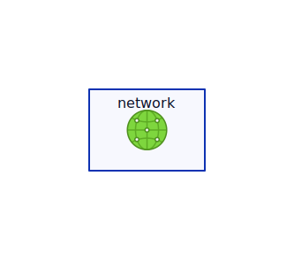

The Astro D2 integration can be used to create diagrams with [icons](https://d2lang.com/tour/icons):

````md title="src/content/docs/example.md"
```d2
container: Docker {
  icon: https://icons.terrastruct.com/dev%2Fdocker.svg
  style: {
    stroke: deepskyblue
    font-color: deepskyblue
    fill: white
  }
  nginx: NGINX {
    icon: https://icons.terrastruct.com/dev%2Fnginx.svg
    style: {
      stroke: green
      font-color: green
      stroke-dash: 3
      fill: white
    }
    astro: Astro {
      style: {
        stroke: "#d841c1"
        font-color: white
        fill: "#75297f"
      }
    }
  }
}
```
````

The above code block will be rendered as the following diagram:

```d2 inline
container: Docker {
  icon: https://icons.terrastruct.com/dev%2Fdocker.svg
  style: {
    stroke: deepskyblue
    font-color: deepskyblue
    fill: white
  }
  nginx: NGINX {
    icon: https://icons.terrastruct.com/dev%2Fnginx.svg
    style: {
      stroke: green
      font-color: green
      stroke-dash: 3
      fill: white
    }
    astro: Astro {
      style: {
        stroke: "#d841c1"
        font-color: white
        fill: "#75297f"
      }
    }
  }
}
```

When using the [`experimental.useD2js` configuration option](/configuration/#used2js), the [`inline` configuration option](/configuration/#inline) or [attribute](/attributes/#inline) must be set to `true` to properly render the icons.

:::tip
A collection of icons commonly found in software architecture diagrams is hosted for free by Terrastruct: https://icons.terrastruct.com
:::

## Relative paths

The Astro D2 integration supports rendering icons with paths relative to your Markdown file.

For example, considering a file located at `src/content/docs/example.md` and an icon located at `src/assets/icon.svg`, you can reference the icon as follows:

````md title="src/content/docs/example.md"
```d2
network: {
  icon: ../../assets/icon.svg
}
```
````

The above code block will be rendered as the following diagram:



When using the [`experimental.useD2js` configuration option](/configuration/#used2js), icons with relative paths are not supported.
